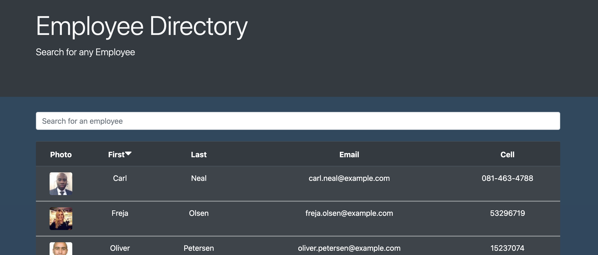
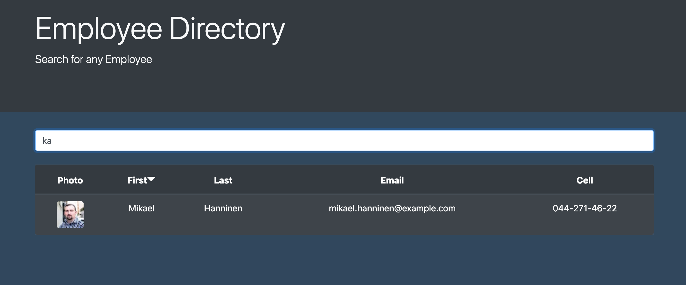

# Employee Directory

## Table of Contents

- [Description](#desciption)
- [Installation](#installation)
- [Usage](#Usage)
- [Contribution](#Contribution)
- [Test](#test)
- [License](#license)

## Description

[Employee Directory](https://israelguillermo.github.io/employee_directory/)

Front end project which generates a list of employees using a third part API. All employees are then listed in a table which can be used to search for by first name or sort through by first name. This application is perfect for any user attempting to keep a list of contacts.

## License

 
None

## Installation

npm i

## Usage

N/A

## Contribution

N/A

## Test

Apllication is live.

## For any additional questions please contact me at:

Email: israelguillermo22@gmail.com
 
GitHub: [IsraelGuillermo](https://github.com/IsraelGuillermo)
